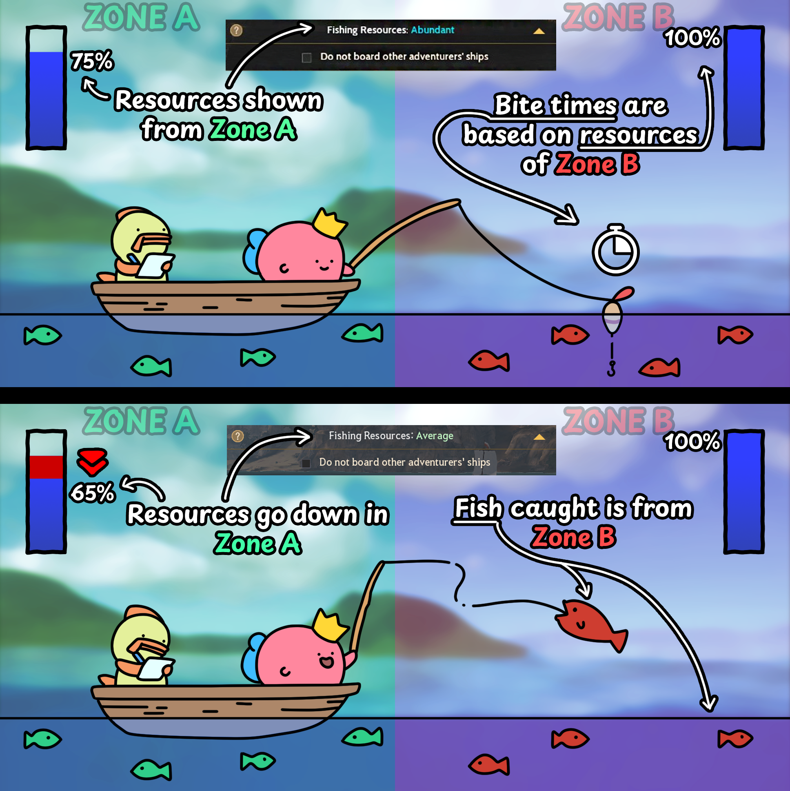
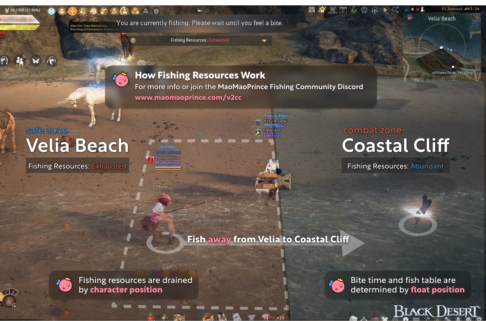

import { Aside } from '@astrojs/starlight/components';

## How do Fishing Resources work?

## How to use this knowledge in Velia

<Aside>Bite Time is tied directly to current Fishing Resource %.  So anyone fishing from coastal cave is making bite times longer for everyone.</Aside>

